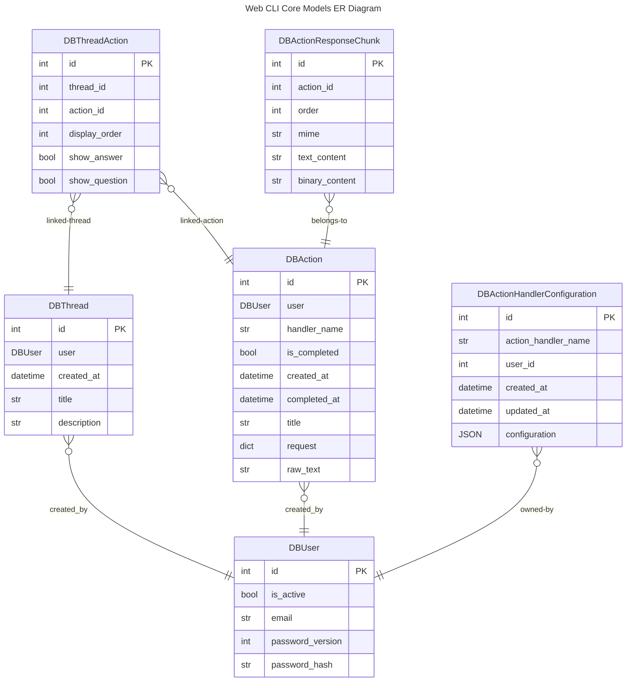

# Index
* core
    * data
        * [db_models](#db_models)
        * [models](#models)

# core
## data
### db_models
These are SQLAlchemy data models.

| Class                           | Description                              |
| ------------------------------- | ---------------------------------------- |
| DBUser                          | A user                                   |
| DBAction                        | An action                                |
| DBActionResponseChunk           | A chunk of action response               |
| DBThread                        | A thread                                 |
| DBThreadAction                  | Represent a thread has an action         |
| DBActionHandlerConfiguration    | User configuration for a action handler  |

### models
These are Pydandic models.

| Class                           | Description                              |
| ------------------------------- | ---------------------------------------- |
| User                            | A user                                   |
| Action                          | An action                                |
| ActionResponseChunk             | A chunk of action response               |
| Thread                          | A thread                                 |
| ThreadAction                    | Represent a thread has an action         |
| ActionHandlerConfiguration      | User configuration for a action handler  |
