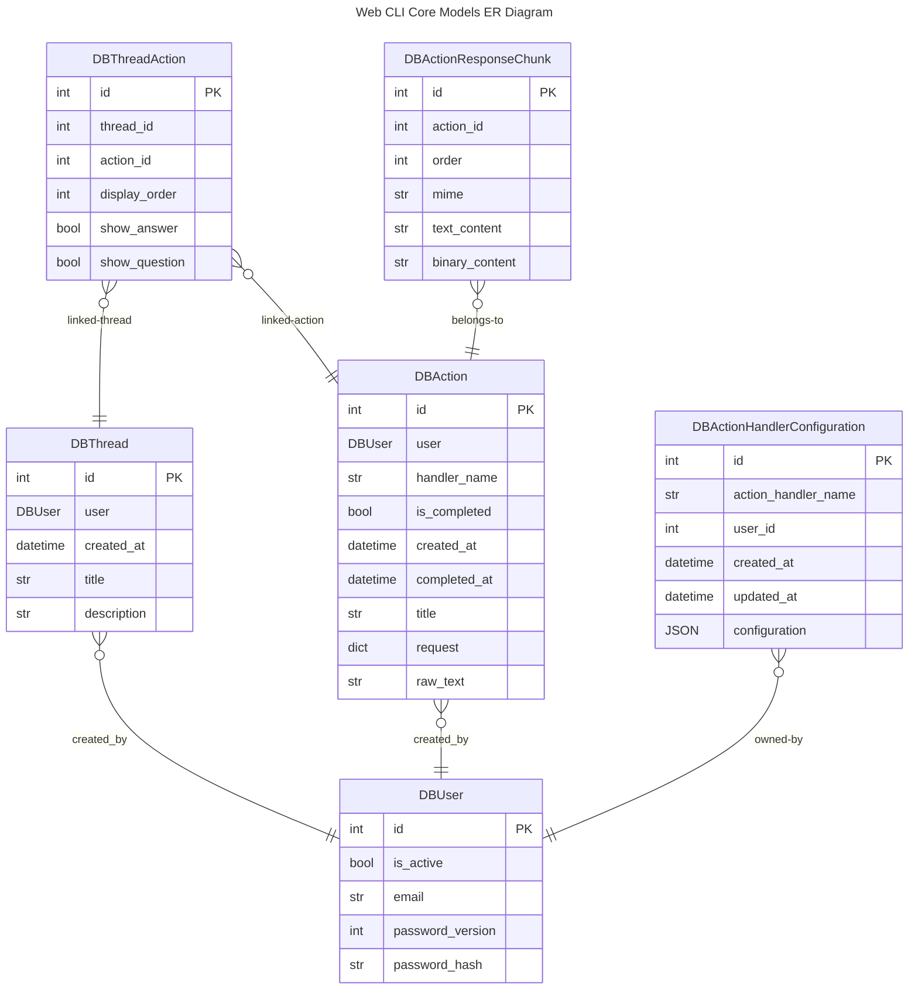

# Index
* Python Modules
    * core
        * data
            * [db_models](#db_models)
            * [models](#models)
            * [DataAccessor](#)
        * [service](#service)
            * [WebCLIService](#webcliservice)
    * [cli](#cli)

# Python Modules
## core
### data
#### db_models
These are SQLAlchemy data models.

| Class                           | Description                              |
| ------------------------------- | ---------------------------------------- |
| DBUser                          | A user                                   |
| DBAction                        | An action                                |
| DBActionResponseChunk           | A chunk of action response               |
| DBThread                        | A thread                                 |
| DBThreadAction                  | Represent a thread has an action         |
| DBActionHandlerConfiguration    | User configuration for a action handler  |

#### models
These are Pydandic models.

| Class                           | Description                              |
| ------------------------------- | ---------------------------------------- |
| User                            | A user                                   |
| Action                          | An action                                |
| ActionResponseChunk             | A chunk of action response               |
| Thread                          | A thread                                 |
| ThreadAction                    | Represent a thread has an action         |
| ActionHandlerConfiguration      | User configuration for a action handler  |

#### DataAccessor
This class provide the Data Accessing Layer. Here are methods

| Method                          | Description                              |
| ------------------------------- | ---------------------------------------- |
| create_user                     | Create a new user                        |
| get_user                        | Retrieve a user by id                    |
| get_user_by_email               | Get user by email. Note: every user has unique email |
| list_thread                     | List all thread a user created           |
| get_thread                      | Retrieve a thread by id                  |
| create_thread                   | Create a new thread                      |
| patch_thread                    | Update a thread, for title, description  |
| create_action                   | Create a new action                      |
| get_action                      | Retrieve an action by ID                 |
| patch_action                    | Update an action, for title              |
| complete_action                 | Set an action to completed (aka, is_completed set to True for the action) |
| append_action_to_thread         | Put the action as the last action of a thread |
| append_response_to_action       | Append a response chunk to an action     |
| remove_action_from_thread       | Remove an action from thread, it does not delete the aciton |
| delete_thread                   | Delete a thread, remove all actions from the thread |
| patch_thread_action             | update ThreadAction's show_question, show_answer |
| get_action_handler_user_config  | get user config for action handler |
| set_action_handler_user_config  | set user config for action handler |
| get_thread_ids_for_action       | Given a action, find all thread that has the action, retrun the list of thread IDs |
| create_all_tables               | Create all database tables |

### Service
This is the service layer module.

#### WebCLIService
This class provide Service API's for Web CLI. Here are methods

| Method                          | Description                              |
| ------------------------------- | ---------------------------------------- |
| create_user                     | Create a new user                        |
| get_user_from_jwt_token         | Given a JWT token, return the user this JWT token represents |
| login_user                      | Authenticate user with email and password |
| generate_user_jwt_token         | Generate a JWT token for a user          |
| list_threads                    | List all thread a user created           |
| create_thread                   | Create a new thread                      |
| get_thread                      | Retrieve a thread by id                  |
| patch_thread                    | Update a thread, for title, description  |
| create_thread_action            | Create an action and put the action into a thread |
| delete_thread                   | Delete a thread, remove all actions from the thread |
| remove_action_from_thread       | Remove an action from thread, it does not delete the aciton |
| patch_action                    | Update an action, for title              |
| append_action_to_thread         | Put the action as the last action of a thread |
| complete_action                 | Set an action to completed (aka, is_completed set to True for the action) |
| append_response_to_action       | Append a response chunk to an action     |
| patch_thread_action             | update ThreadAction's show_question, show_answer |
| get_action_handler_user_config  | get user config for action handler |
| set_action_handler_user_config  | set user config for action handler |
| get_action_user                 | Given an action, return the user of the action |
| websocket_endpoint              | Web Socket Hanlder |
| get_action_handler              | Get registered action handler by name |
| create_all_tables               | Create all database tables |

## cli
| Method                          | Description                              |
| ------------------------------- | ---------------------------------------- |
| webcli                          | entry method for Python Package CLI      |
| webcli_internal                 | internal entry function for web cli      |

`webcli` initializing logging then pass control to `webcli_internal`, this is to make sure logging are initialized before we import any required python packages.
