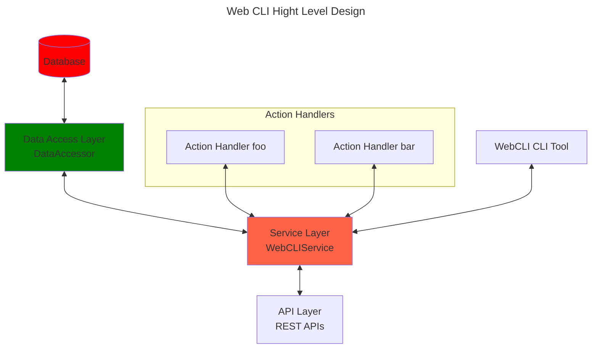
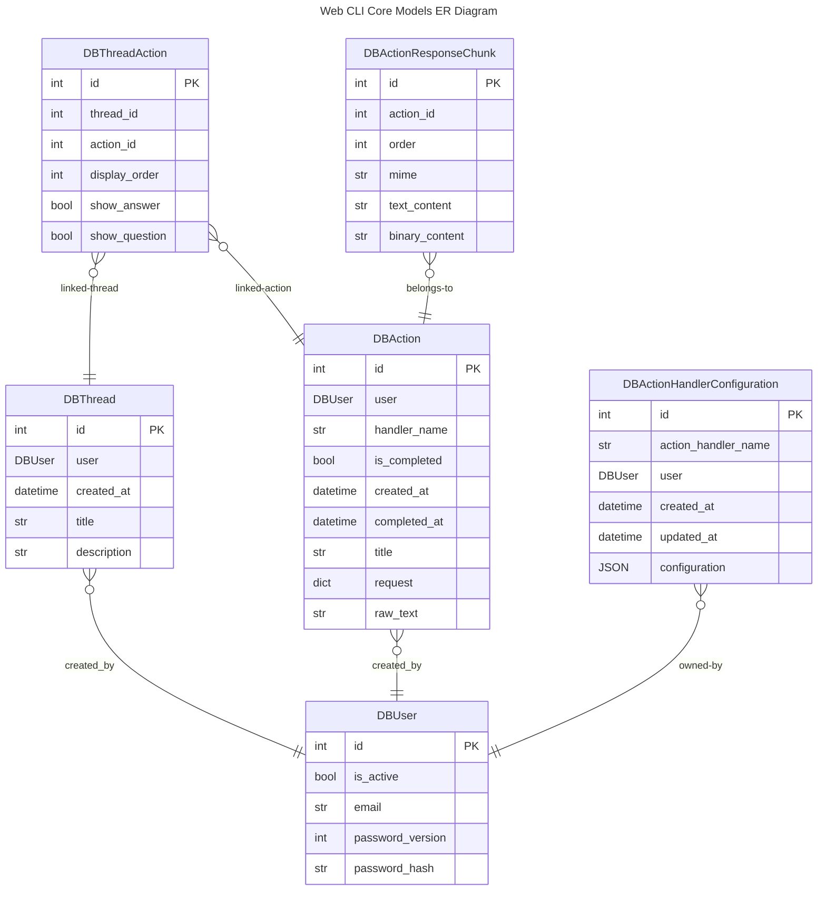
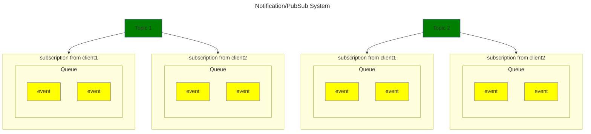

# Index
* [High Level Design](#high-level-design)
* [Python Modules](#python-modules)
    * [core](#core)
        * [data](#data)
            * [db_models](#db_models)
            * [models](#models)
            * [DataAccessor](#dataaccessor)
        * [service](#service)
            * [Notifications](#notifications)
            * [WebCLIService](#webcliservice)
    * [cli](#cli)

# High Level Design

# Python Modules
## core
### data
`webcli2.core.data` module provides the Data Access Layer, it provide a set of APIs to manage `Model` objects. `DBModules` module is internal, all are SQLAlchemy models, `DBModule` is never designed to be visible outsoude the Data Layer, while  `Models` is designed to be publicly visible.

#### db_models
These are SQLAlchemy data models.

| Class                           | Description                              |
| ------------------------------- | ---------------------------------------- |
| DBUser                          | A user                                   |
| DBAction                        | An action                                |
| DBActionResponseChunk           | A chunk of action response               |
| DBThread                        | A thread                                 |
| DBThreadAction                  | Represent a thread has an action         |
| DBActionHandlerConfiguration    | User configuration for a action handler  |

We use singular for table name, for example, we use name "DBUser" instead of "DBUsers" as table name. Use singular as table name, the advantage is the table name match the name of DBModel name, which is easy to manage.

#### models
These are Pydandic models.

| Class                           | Description                              |
| ------------------------------- | ---------------------------------------- |
| User                            | A user                                   |
| Action                          | An action                                |
| ActionResponseChunk             | A chunk of action response               |
| Thread                          | A thread                                 |
| ThreadAction                    | Represent a thread has an action         |
| ActionHandlerConfiguration      | User configuration for a action handler  |

#### DataAccessor
This class provide the Data Accessing Layer. It's input method's argument can reference Model, output can also reference Model, but it never exposes DBModel as input, nor output. Here are methods. see [core.data.DataAccessor](../../src/webcli2/core/data/data_accessor.py)

| Method                          | Description                              |
| ------------------------------- | ---------------------------------------- |
| create_user                     | Create a new user                        |
| get_user                        | Retrieve a user by id                    |
| get_user_by_email               | Get user by email. Note: every user has unique email |
| list_thread                     | List all thread a user created           |
| get_thread                      | Retrieve a thread by id                  |
| create_thread                   | Create a new thread                      |
| patch_thread                    | Update a thread, for title, description  |
| create_action                   | Create a new action                      |
| get_action                      | Retrieve an action by ID                 |
| patch_action                    | Update an action, for title              |
| complete_action                 | Set an action to completed (aka, is_completed set to True for the action) |
| append_action_to_thread         | Put the action as the last action of a thread |
| append_response_to_action       | Append a response chunk to an action     |
| remove_action_from_thread       | Remove an action from thread, it does not delete the aciton |
| delete_thread                   | Delete a thread, remove all actions from the thread |
| patch_thread_action             | update ThreadAction's show_question, show_answer |
| get_thread_ids_for_action       | Given a action, find all thread that has the action, retrun the list of thread IDs |
| get_action_handler_user_config  | get user config for action handler |
| set_action_handler_user_config  | set user config for action handler |

### Service
This is the service layer module.

#### Notifications
This is a internal module, used by WebCLIService.

* NotificationManager manages multiple topics, each topic has unique `topic_name`
* Each topic has multiple subscribers, each subscriber has their own unique `client_id`
* Each subscriber has multiple event in queue
* Client calls `pop_notification` to pop event from queue associated with the client subscription.
* `NotificationManager.publish_notification` enqueue event to respective topic

#### WebCLIService
This class provide Service API's for Web CLI. Here are methods

| Method                          | Description                              |
| ------------------------------- | ---------------------------------------- |
| create_user                     | Create a new user                        |
| get_user_from_jwt_token         | Given a JWT token, return the user this JWT token represents |
| login_user                      | Authenticate user with email and password |
| generate_user_jwt_token         | Generate a JWT token for a user          |
| list_threads                    | List all thread a user created           |
| create_thread                   | Create a new thread                      |
| get_thread                      | Retrieve a thread by id                  |
| patch_thread                    | Update a thread, for title, description  |
| create_thread_action            | Create an action and put the action into a thread |
| delete_thread                   | Delete a thread, remove all actions from the thread |
| remove_action_from_thread       | Remove an action from thread, it does not delete the aciton |
| patch_action                    | Update an action, for title              |
| append_action_to_thread         | Put the action as the last action of a thread |
| complete_action                 | Set an action to completed (aka, is_completed set to True for the action) |
| append_response_to_action       | Append a response chunk to an action     |
| patch_thread_action             | update ThreadAction's show_question, show_answer |
| get_action_handler_user_config  | get user config for action handler |
| set_action_handler_user_config  | set user config for action handler |
| websocket_endpoint              | Web Socket Hanlder |
| get_action_handler              | Get registered action handler by name |
| create_all_tables               | Create all database tables |

## cli
The webcli2 has a command line script registered with method `webcli2.cli.webcli`, it provides a command line entry for webcli2, so you can do some management work for webcli, such as start the server, create user, initialize database.

| Method                          | Description                              |
| ------------------------------- | ---------------------------------------- |
| webcli                          | entry method for Python Package CLI      |
| webcli_internal                 | internal entry function for web cli      |

`webcli` initializing logging then pass control to `webcli_internal`, this is to make sure logging are initialized before we import any required python packages.
