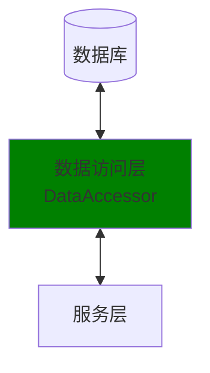
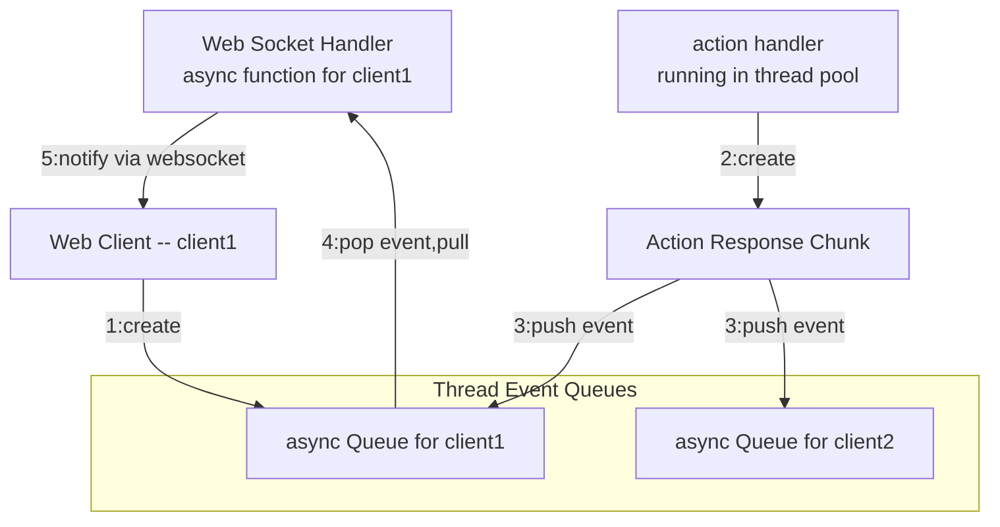

# 系统设计
```
core/data                   数据访问层。详细内容请看DataAccessor类
                            这层的接口使用Model (Pydandic Model, not SQLAlchemy Model)
-------------------------------------------------------------------------------------------------
core/service                服务层                            
```

# 系统结构图


# 发送action response的设计

* 1: 当用户浏览thread页面时，会建立websocket连接，发送client_id和thread_id，服务器会创建Thread Event Queues，并且在其中为client1创建一个async Queue
* 2: 当action handler要输出时，会创建一个`ActionResponseChunk`对象
* 3: 针对刚才创建的`ActionResponseChunk`，创建一个event，放入`Thread Event Queue`
* 4: 服务器中，每个websocket有一个async 函数，循环poll event (从`Thread Event Queue`)
* 5: 一旦获得消息，则将消息通过Web Socket发送给浏览器
