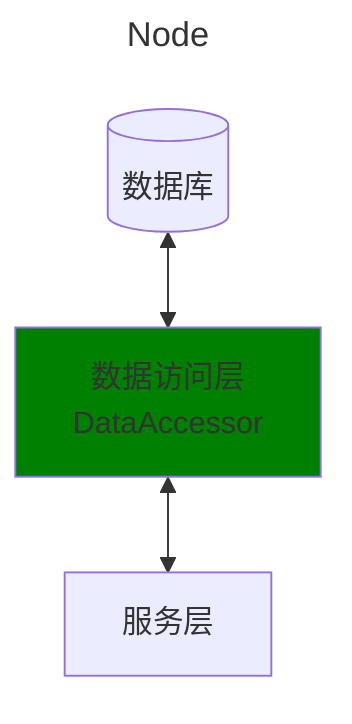

# 系统设计
```
core/data                   数据访问层。详细内容请看DataAccessor类
                            这层的接口使用Model (Pydandic Model, not SQLAlchemy Model)
-------------------------------------------------------------------------------------------------
core/service                服务层                            
```

# 系统结构图
