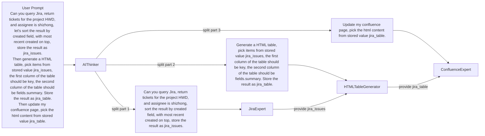

# Index
* Single AI Agent Examples
    * [Mock Example](#mock-example)
    * [Real Example](#real-example)
* [Multi AI Agent Examples](#multi-ai-agent-example)


# Create an AI Tool
## Mock Example
Let's start with a mock example. In this example, we are creating a simple AI Tool for querying Jira. When the tool is called, simply print the JQL query generated by OpenAI instead of making Jira API call.

```python
%python%

from typing import List
from webcli2.core.ai import Task, AgenticMixin, Tool, Message, MessageRole
from pydantic import BaseModel, Field, ConfigDict

# Step 1: define tool, and it's input type
class JQLInput(BaseModel):
    jql_query: str = Field(..., description="The JQL Query String") # Make the description easy to understand by LLM
    model_config = ConfigDict(extra='forbid')

class MockJiraTool(Tool):
    def run(self, input:JQLInput):
        print(f"running query: {input.jql_query}")

# Step 2: define AI Agent
#         during __init__, create a tool, register it
#         implement method run, call ask_llm provided by AgenticMixin
class JiraAgent(Task, AgenticMixin):
    def __init__(self):
        super().__init__(name="Jira Agent", description="Jira Agent", requires=["question"])
        jira_tool = MockJiraTool(name="run_jql_query", description="Execute JQL Query", input_type=JQLInput)
        self.add_tool(jira_tool) # register the necessary tool

    def run(self):
        self.ask_llm([Message(role=MessageRole.USER, content=self.get_variable("question"))])

# Step 3: instantiate AI Agent, provide variable it requires, and run it 
jira_agent = JiraAgent()
question = """
Can you generate a JQL query, the query need to return all JIRA ticket for project HWD, and assignee is shizhong, let's sort the result by created field, with most recent created on top. Use the provided tool to fetch data.
"""
jira_agent.set_variable("question", question)
r = jira_agent.run()
```

## Real Example
Now let's run a real example, instead of mocking the JQL query, we are going to execute the JQL query.

```python
%python%

from typing import List
from webcli2.core.ai import Task, AgenticMixin, Tool, Message, MessageRole
from pydantic import BaseModel, Field, ConfigDict
from webcli2.core.ai.libs.oracle import OracleTools

# Step 1: define tool, and it's input type
class JQLInput(BaseModel):
    jql_query: str = Field(..., description="The JQL Query String") # Make the description easy to understand by LLM
    model_config = ConfigDict(extra='forbid')

class JiraTool(Tool):
    def run(self, input:JQLInput):
        oracle_tools = OracleTools()
        jira_issues = oracle_tools.jira_execute_jql(input.jql_query)
        for jira_issue in jira_issues:
            print(f"{jira_issue.key} -- {jira_issue.fields.summary}")

# Step 2: define AI Agent
#         during __init__, create a tool, register it
#         implement method run, call ask_llm provided by AgenticMixin
class JiraAgent(Task, AgenticMixin):
    def __init__(self):
        super().__init__(name="Jira Agent", description="Jira Agent", requires=["question"])
        jira_tool = JiraTool(name="run_jql_query", description="Execute JQL Query", input_type=JQLInput)
        self.add_tool(jira_tool) # register the necessary tool

    def run(self):
        self.ask_llm([Message(role=MessageRole.USER, content=self.get_variable("question"))])

# Step 3: instantiate AI Agent, provide variable it requires, and run it 
jira_agent = JiraAgent()
question = """
Can you generate a JQL query, the query need to return all JIRA ticket for project HWD, and assignee is shizhong, let's sort the result by created field, with most recent created on top. Use the provided tool to fetch data.
"""
jira_agent.set_variable("question", question)
r = jira_agent.run()
```

Here is the screenshot when you run this AI Agent:


# Multi AI Agent Example

* [JiraExpert](https://github.com/stonezhong/webcli/blob/master/src/webcli2/demo/jira_expert.py)
* [HTMLTableGenerator](https://github.com/stonezhong/webcli/blob/master/src/webcli2/demo/html_table_generator.py)
* [ConfluenceExpert](https://github.com/stonezhong/webcli/blob/master/src/webcli2/demo/confluence_expert.py)

Here is how it works.
* When you create AIThinker, you add bunch of AI Agent that can help to solve customer's problem.
* When you ask AIThinker a question, it won't try to solve the question directly, instead, it will try to divide the question into small questions that each can be answered by one of the registered AI Agent.
* We have three AI Agent here: JiraExpert, HTMLTableGenerator and ConfluenceExpert.

First, you ask the AIThinker following question: 
```
Can you query Jira, return tickets for the project HWD, and assignee is shizhong, let's sort the result by created field, with most recent created on top, store the result as jira_issues.
Then generate a HTML table, pick items from stored value jira_issues, the first column of the table should be key, the second column of the table should be fields.summary. Store the result as jira_table.
Then update my confluence page, pick the html content from stored value jira_table.
```

Now, AIThinker will breakdown the question into 3 smaller question, and pass to different AI Agent

- It asks JiraExpert this question: `Can you query Jira, return tickets for the project HWD, and assignee is shizhong, sort the result by created field, with most recent created on top, store the result as jira_issues.`
- It asks HTMLTableGenerator this question: `Generate a HTML table, pick items from stored value jira_issues, the first column of the table should be key, the second column of the table should be fields.summary. Store the result as jira_table.`
- It asks ConfluenceExpert this question: `Update my confluence page, pick the html content from stored value jira_table.`

Now `HTMLTableGenerator` cannot start to work since it requires variable `jira_issues` sincew we have `...pick items from stored value jira_issues`.
`ConfluenceExpert` cannot start to work since it requires variable `jira_table`, since we have `...pick the html content from stored value jira_table.`

However, `JiraExpert` can work directly, so it asks LLM and get a JQL statement. It use the JQLQueryTool to execute JQL statement and save jira issues into variable `jira_issues` since we have `...store the result as jira_issues.`

Now HTMLTableGenerator can start to work since `jira_issues` variable has been provided, as it works, it generate variable `jira_table`, so it unblocks `ConfluenceExpert`, so ConfluenceExpert start to work, it update my confluence page using the congtent in `jira_table`. 

So the job is done.

Here is a diagram:


```python
%python%

from webcli2.core.ai import cli_print, AIThinker, AIAgentInfo
from webcli2.demo.jira_expert import JiraExpert
from webcli2.demo.html_table_generator import HTMLTableGenerator
from webcli2.demo.confluence_expert import ConfluenceExpert

top_task = AIThinker(
    name="My Personal Assistant at Oracle", 
)
top_task.add_agent_factory(AIAgentInfo.from_class(JiraExpert))
top_task.add_agent_factory(AIAgentInfo.from_class(ConfluenceExpert))
top_task.add_agent_factory(AIAgentInfo.from_class(HTMLTableGenerator))
top_task.set_variable(
    "prompt", 
    """\
Can you query Jira, return tickets for the project HWD, and assignee is shizhong, let's sort the result by created field, with most recent created on top, store the result as jira_issues.
Then generate a HTML table, pick items from stored value jira_issues, the first column of the table should be key, the second column of the table should be fields.summary. Store the result as jira_table.
Then update my confluence page, pick the html content from stored value jira_table.
"""
)
top_task.run()
cli_print("<h1>Done</h1>")
```

