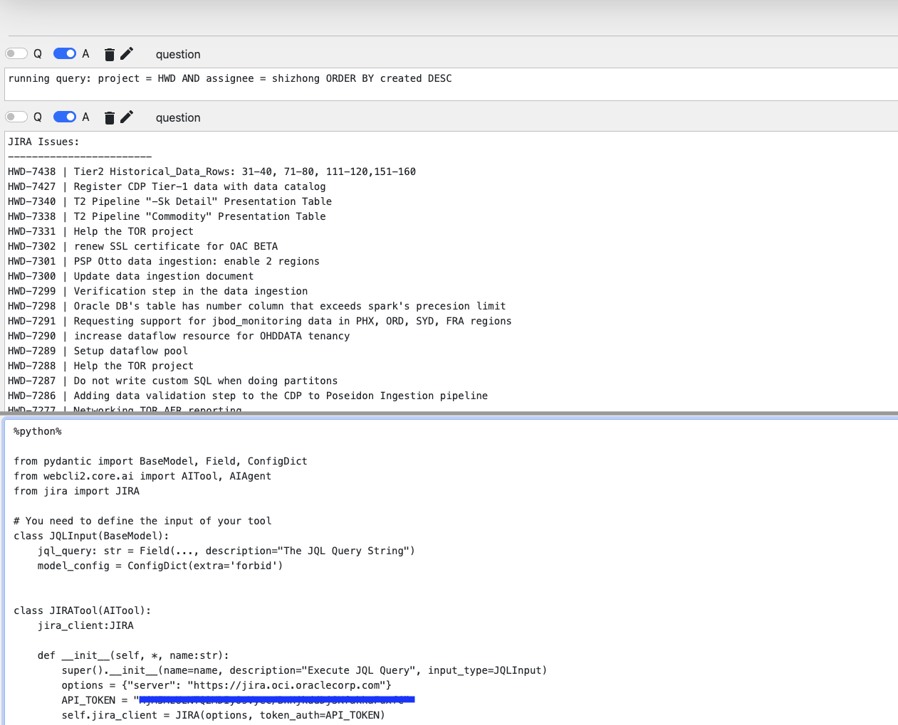

# Index
* Create an AI Tool
    * Mock Example

# Create an AI Tool
## Mock Example
Let's start with a mock example, which is easier to understand. In this example, we are creating a simple AI Tool for querying JIRA. When the tool is called, simply print the JQL query generated by OpenAI. But you can easily replace the JIRATool.invoke implementation with real JIA Query.

```python
%python%

from pydantic import BaseModel, Field, ConfigDict
from webcli2.core.ai import AIAgent, create_ai_agent

# Define the input type of your AI Tool
class JQLInput(BaseModel):
    jql_query: str = Field(..., description="The JQL Query String") # Make the description easy to understand by OpenAI
    model_config = ConfigDict(extra='forbid')  # This is required by OpenAI

# Create an AI Agent
ai_agent = create_ai_agent()

# Define an AI Tool that can execute a JQL Query
@ai_agent.aitool(description="Execute JQL Query")
def run_jql_query(input:JQLInput):
    print(f"running query: {input.jql_query}")

question = """
Can you generate a JQL query, the query need to return all JIRA ticket for project HWD, and assignee is shizhong, let's sort the result by created field, with most recent created on top. Use the provided tool to fetch data.
"""
r = ai_agent.run(question) # ask question to AI Engine, take the response and run the AI Tools
```

## Real Example
Now let's run a real example, instead of mocking the JQL query, we are going to execute the JQL query.

```python
%python%

# Make sure you have jira installed: pip install jira

from pydantic import BaseModel, Field, ConfigDict
from webcli2.core.ai import AIAgent, create_ai_agent
from jira import JIRA

# You need to define the input of your tool
class JQLInput(BaseModel):
    jql_query: str = Field(..., description="The JQL Query String")
    model_config = ConfigDict(extra='forbid')

# Create an AI Agent
ai_agent = create_ai_agent()

# Define an AI Tool that can execute a JQL Query
@ai_agent.aitool(description="Execute JQL Query")
def run_jql_query(input:JQLInput):
    options = {"server": "https://jira.oci.oraclecorp.com"}
    API_TOKEN = "***"
    jira_client = JIRA(options, token_auth=API_TOKEN)
    cli_print(f"Running JQL Query: {input.jql_query}", mime="text/plain")
    issues = jira_client.search_issues(input.jql_query, maxResults=100)
    cli_print("JIRA Issues:", mime="text/plain")
    cli_print("------------------------", mime="text/plain")
    for issue in issues:
        cli_print(f"{issue.key} | {issue.fields.summary}", mime="text/plain")
    cli_print("------------------------", mime="text/plain")

question = """
Can you generate a JQL query, the query need to return all JIRA ticket for project HWD, and assignee is shizhong, let's sort the result by created field, with most recent created on top. Use the provided tool to fetch data.
"""
cli_print("<h1>Question</h1>")
cli_print(question, mime="text/plain")
r = ai_agent.run(question) # ask question to AI Engine, take the response and run the AI Tools
```

Here is the screenshot when you run this AI Agent:


