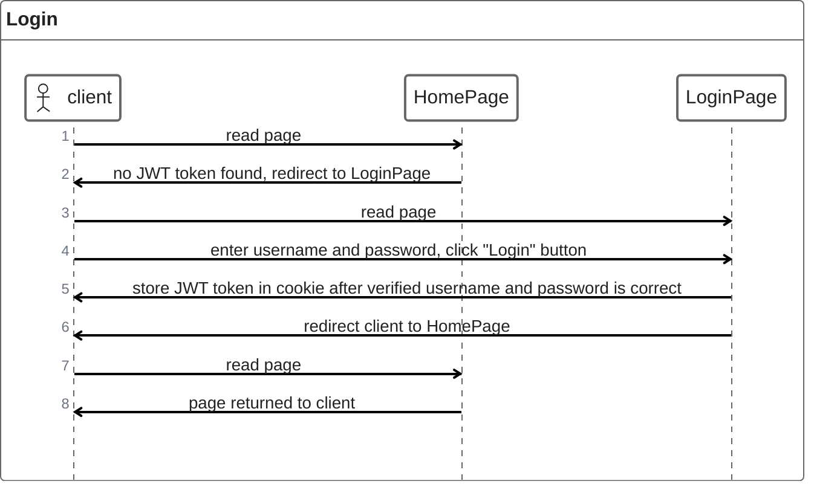
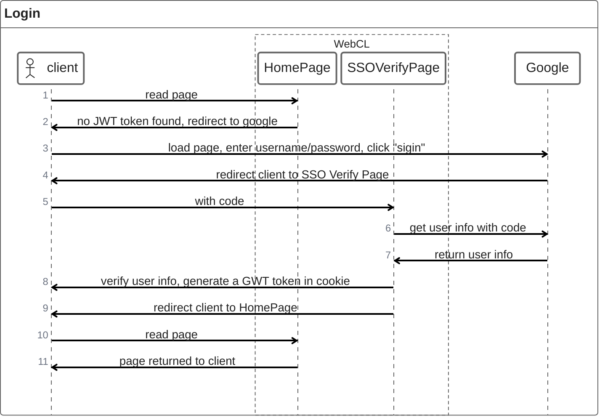

# Local Login

```mermaid
zenuml
    title Login
    @Actor client
    client->HomePage: read page
    HomePage->client: no JWT token found, redirect to LoginPage
    client->LoginPage: read page
    client->LoginPage: enter username and password, click "Login" button
    LoginPage->client: store JWT token in cookie after verified username and password is correct
    LoginPage->client: redirect client to HomePage
    client->HomePage: read page
    HomePage->client: page returned to client
```

# OAuth Login
Use google as example

```mermaid
zenuml
    title Login
    @Actor client
    group WebCL {
        HomePage
        SSOVerifyPage
    }
    client->HomePage: read page
    HomePage->client: no JWT token found, redirect to google
    client->Google: load page, enter username/password, click "sigin"
    Google->client: redirect client to SSO Verify Page
    client->SSOVerifyPage: with code
    SSOVerifyPage->Google: get user info with code
    Google->SSOVerifyPage: return user info
    SSOVerifyPage->client: verify user info, generate a GWT token in cookie
    SSOVerifyPage->client: redirect client to HomePage
    client->HomePage: read page
    HomePage->client: page returned to client
```
