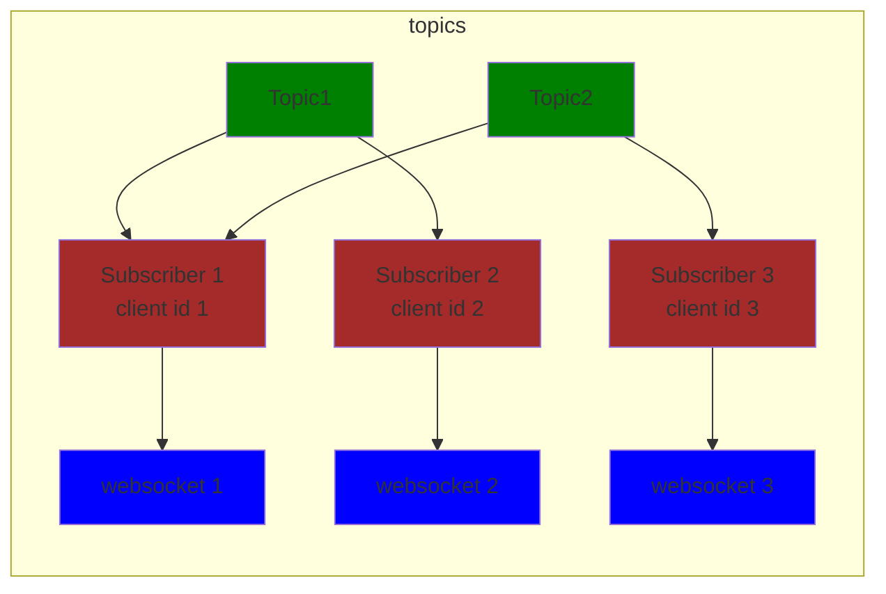

# Notification

```mermaid
flowchart LR

classDef topicbox fill:green
classDef subsribnerbox fill:brown
classDef websocketbox fill:blue

subgraph topics
    direction TB
    
    t1[Topic1]:::topicbox
    t2[Topic2]:::topicbox
    sub1[Subscriber 1
        client id 1
    ]:::subsribnerbox
    sub2[Subscriber 2
        client id 2
    ]:::subsribnerbox
    sub3[Subscriber 3
        client id 3
    ]:::subsribnerbox
    ws1[websocket 1]:::websocketbox
    ws2[websocket 2]:::websocketbox
    ws3[websocket 3]:::websocketbox

    t1[Topic1] --> sub1
    t1[Topic1] --> sub2

    t2[Topic2] --> sub1
    t2[Topic2] --> sub3

    sub1 --> ws1
    sub2 --> ws2
    sub3 --> ws3
end

```